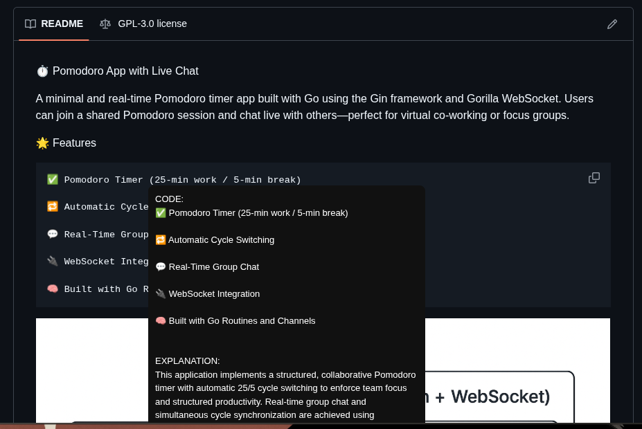

# 🔍 WhatTheCode — AI Code Explainer (Chrome Extension)

WhatTheCode is a Chrome extension that instantly explains code when you hover over it — anywhere on GitHub.  
It uses a local Python backend (Flask) + Gemini API to generate fast, concise explanations.

Perfect for:
- Reading unfamiliar code  
- Reviewing pull requests  
- Exploring open-source projects  
- Understanding tricky code blocks instantly  

---

## 🚀 Features

- 🖱 **Hover to explain** — Just move your mouse over any code block  
- ⚡ **Instant explanations** — AI-generated, concise, helpful  
- 🧠 **Works across GitHub** (README, file viewer, diffs, PRs, gists)  
- 🔒 **Privacy-friendly** — Only your local machine communicates with Gemini  
- 🛠 **Dynamic DOM watching** — Handles GitHub’s PJAX navigation  

---

## 🖼 Demo Screenshot

> Upload this file to your repo at:  
> `static/screenshot-2025-11-30_23-39-56.png`

---

## 🧩 How It Works

### 1️⃣ Chrome Extension (Manifest v3)

The content script automatically detects code blocks:
- `pre`
- `code`
- `.blob-code`
- `.blob-code-inner`
- `.js-file-line`
- `table.highlight td`

Then it sends the code to the background script → your Python backend → Gemini API → returns an explanation.

### 2️⃣ Python Backend (Flask)

The backend:
- Accepts POST requests from the extension  
- Sends code to Gemini API  
- Returns clean, plain-text explanations  
- Enables CORS so Chrome can talk to it  

### 3️⃣ Tooltip Overlay UI

A floating tooltip appears next to the cursor:

